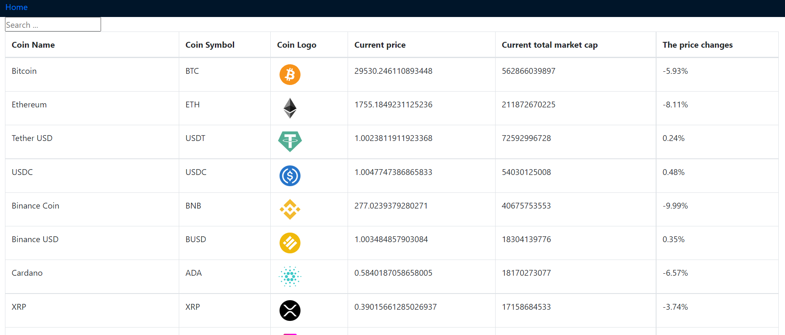
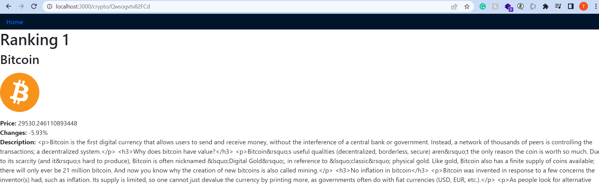

# Care Crypto Challenge Application

## Available Scripts

To clone the application using this command
### `git clone https://github.com/EricTrinh153/Care-Challenge.git`

Install all packages and dependencies before starting the application
### `yarn install`

To start application using this command
### `yarn start`

**Explanation:**

 - I created the application using different API url because the original url of Coinranking having CORS policy so I needed to turn on the CORS extension on my browser if I wanted to retrieve the data so that was why I chose to use the alternative API url of RapidAPI instead.
 - I am not familiar with Typescript so I did this application without application the typescript template.
 - Below are the requirements I completed based on the given documents
    + Include the sorting function for 3 fields (Price, Market Cap and Change respectively)
    + Include the onClick event which help the user to have information of a single crypto
    + Include the searching function by name for users
  - ReactAPI context: I used Redux to fetch and store data from API server which will be resuable for the next usage
  - I imported Bootstrap library into the index.html file and applied styling for container and table so it can be consider as responsive.
  - There are some ES6 functionalities I already included: Arrow function, String.includes(), const and let keyword, etc
   
   **Deliverable:**
   
   
   

